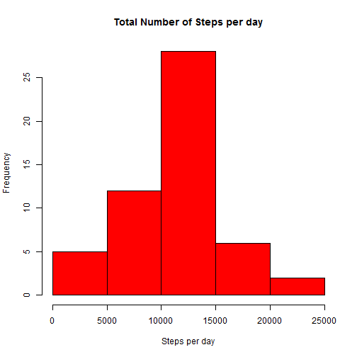
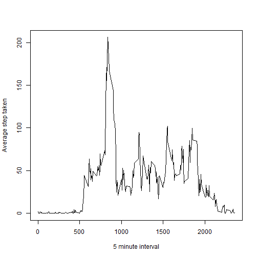
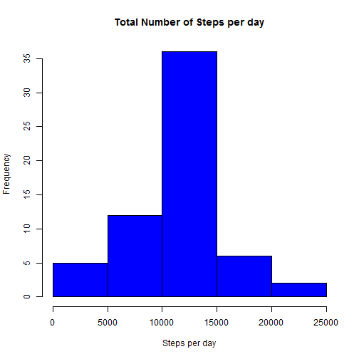
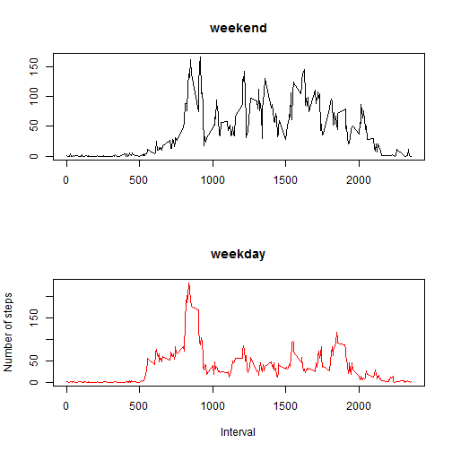
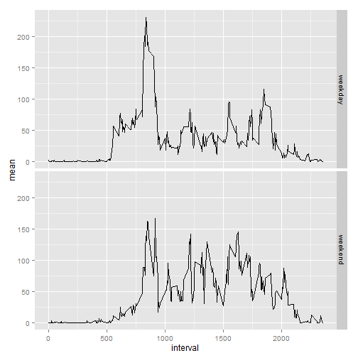

# Reproducible Research: Peer Assessment 1

## Loading and preprocessing the data

```r
setwd("C:/Users/ccortes/Documents/GitHub/RepData_PeerAssessment1")
zfile <- "C:/Users/ccortes/Documents/GitHub/RepData_PeerAssessment1/activity.zip"
dfile <- "C:/Users/ccortes/Documents/GitHub/RepData_PeerAssessment1/activity.csv"
if(!file.exists(dfile)) {
        unzip(zfile, exdir='.')
}
activity <- read.csv(dfile, header = TRUE)
```

## What is mean total number of steps taken per day?

```r
# Rows with values (not NA)
a <- activity[!is.na(activity$steps),]

# 1) Calculate the total number of steps taken per day
a_date <- aggregate(x = a[,c("steps")], by = list(a$date), FUN = "sum")
names(a_date) <- c("date", "steps")

# 2) Make a histogram of the total number of steps taken each day
hist(a_date$steps, main = "Total Number of Steps per day", xlab = "Steps per day", col = "red")
```

 

```r
# 3) Calculate and report the mean and median of the total number of steps taken per day
mean(a_date$steps)
```

```
## [1] 10766.19
```

```r
median(a_date$steps)
```

```
## [1] 10765
```

## What is the average daily activity pattern?

```r
# Grouping by interval with mean of steps
a_int <- aggregate(x = a[,c("steps")], by = list(a$interval), FUN = "mean")
names(a_int) <- c("interval", "mean")

# 1) Make a time series plot of the 5-minute interval (x-axis) and the average number of steps taken, 
#    averaged across all days (y-axis)
plot(a_int$interval, a_int$mean, type="l" , xlab = "5 minute interval", ylab = "Average step taken")
```

 

```r
# 2) Which 5-minute interval, on average across all the days in the dataset, contains the maximum number of steps?
a_int[a_int$steps == max(a_int$steps), "interval"]
```

```
## Warning in max(a_int$steps): no non-missing arguments to max; returning
## -Inf
```

```
## integer(0)
```

## Imputing missing values

```r
# Rows without value (na)
# 1) Calculate and report the total number of missing values in the dataset (i.e. the total number of rows with NAs)
a_na  <- activity[is.na(activity$steps),]
str(a_na)
```

```
## 'data.frame':	2304 obs. of  3 variables:
##  $ steps   : int  NA NA NA NA NA NA NA NA NA NA ...
##  $ date    : Factor w/ 61 levels "2012-10-01","2012-10-02",..: 1 1 1 1 1 1 1 1 1 1 ...
##  $ interval: int  0 5 10 15 20 25 30 35 40 45 ...
```

```r
# 2) Devise a strategy for filling in all of the missing values in the dataset. 
#    The strategy does not need to be sophisticated. 
#    For example, you could use the mean/median for that day, 
#    or the mean for that 5-minute interval, etc.

# Merging a_na (with NA values in a_na$steps) with a_int to get the mean steps by interval and replace the empty a_na$steps
a_na1 <- merge(a_na, a_int, by.x = c("interval"), by.y = c("interval"))
a_na_fill <- data.frame(round(a_na1$mean), a_na1$date, a_na1$interval)
names(a_na_fill) <- c("steps", "date", "interval")

# 3) Create a new dataset that is equal to the original dataset but with the missing data filled in.
a_fill <- rbind(a, a_na_fill)

# 4) Make a histogram of the total number of steps taken each day and 
#    Calculate and report the mean and median total number of steps taken per day. 
#    Do these values differ from the estimates from the first part of the assignment? 
#    What is the impact of imputing missing data on the estimates of the total daily number of steps?

# Grouping by date with total steps
a_filled <- aggregate(x = a_fill[,c("steps")], by = list(a_fill$date), FUN = "sum")
names(a_filled) <- c("date", "steps")

hist(a_filled$steps, main = "Total Number of Steps per day", xlab = "Steps per day", col = "blue")
```

 

```r
mean(a_filled$steps)
```

```
## [1] 10765.64
```

```r
median(a_filled$steps)
```

```
## [1] 10762
```


## Are there differences in activity patterns between weekdays and weekends?

```r
# 1) Create a new factor variable in the dataset with two levels - "weekday" and "weekend" 
#    indicating whether a given date is a weekday or weekend day
# Adding week_day factor new column  
a_fill$week_day <- as.factor(ifelse(weekdays(as.Date(a_fill$date)) == "Saturday" | weekdays(as.Date(a_fill$date)) == "Sunday", "weekend", "weekday"))

# Grouping by interval with mean of steps
a_fill_int <- aggregate(x = a_fill[,c("steps")], by = list(a_fill$interval, a_fill$week_day), FUN = "mean")
names(a_fill_int) <- c("interval", "week_day", "mean")

# 2) Make a panel plot containing a time series plot (i.e. type = "l") of the 5-minute interval (x-axis) 
#    and the average number of steps taken, averaged across all weekday days or weekend days (y-axis). 

par(mfrow = c(2,1)) 
plot(a_fill_int[a_fill_int$week_day == "weekend", "interval"]
    ,a_fill_int[a_fill_int$week_day == "weekend", "mean"]   
    ,type="l" , main = "weekend" , xlab = "", ylab = "")
plot(a_fill_int[a_fill_int$week_day == "weekday", "interval"]
    ,a_fill_int[a_fill_int$week_day == "weekday", "mean"]    
    ,type="l" , main = "weekday", xlab = "Interval", ylab = "Number of steps", col = "red")
require(ggplot2)
```

```
## Loading required package: ggplot2
## Find out what's changed in ggplot2 with
## news(Version == "1.0.0", package = "ggplot2")
```

 

```r
require(reshape)
```

```
## Loading required package: reshape
```

```
## Warning in library(package, lib.loc = lib.loc, character.only = TRUE,
## logical.return = TRUE, : there is no package called 'reshape'
```

```r
ggplot(a_fill_int, aes(interval, mean)) + geom_line() + facet_grid(week_day ~.)
```

 
